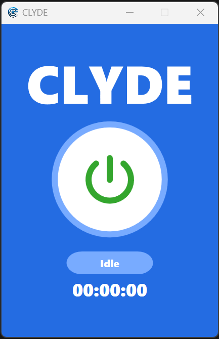
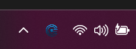
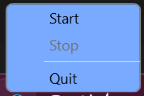

Clyde
=====

"CLYDE" is an open-source software available for free, aiming to simulate user interaction on a computer to emulate screen activity.

## Screenshots

## Platform

CLYDE is a [WPF](https://en.wikipedia.org/wiki/Windows_Presentation_Foundation) Application and uses [.NET Framework 4.7.2](https://dotnet.microsoft.com/en-us/download/dotnet-framework/net472). With the [.NET Framework 4.7.2](https://dotnet.microsoft.com/en-us/download/dotnet-framework/net472) it should run native on Windows machines.

## Usage
Start Clyde.exe. After you have done this, you can click the button to activate/deactivate Clyde. Alternatively, you can control Clyde via the system tray. Clyde continues to run even when the window is closed. Clyde can only be closed via the system tray.

The Application color theme can differ from the shown screenshots because the current system settings will determine the color theme that the App should use.

## IDE

CLYDE can be opened with IDEs such as [Visual Studio](https://visualstudio.microsoft.com/downloads/) by opening the .sln or .csproj file.